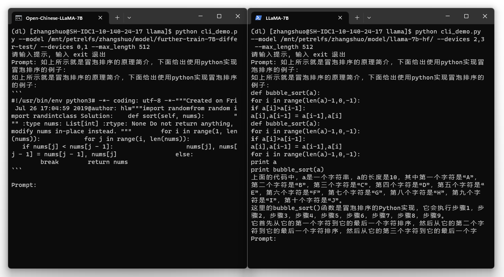

[**中文**](./README.md) | [**English**](./README_EN.md)

# Open-Chinese-LLaMA

[]()[]()[]()[]()

本项目为基于 [LLaMA](https://github.com/facebookresearch/llama)-7B 经过 **中文数据集增量预训练** 产生的 **中文大语言模型基座**。

## 特点

* 本项目为通过全量微调（Full-tuning）获得的中文预训练模型，提供 huggingface 版本权重
* 对比原版 LLaMA，本模型在中文理解能力和生成能力方面均获得较大提升，在众多下游任务中均取得了突出的成绩，详见 [评测](##评测)
* 本项目提供了 Huggingface 版本权重和 Meta 版本权重的转换工具
* 支持 [🤗transformers](https://github.com/huggingface/transformers)，提供命令行工具方便测试模型效果

## 目录
* [模型下载](##模型下载)
* [本地 Demo](##本地Demo)
* [评测](##评测)
* [模型格式转换](##模型格式转换)

## 模型下载

| 模型名称                    | 权重类型 | 下载地址                                                     | SHA256                 |
| --------------------------- | -------- | ------------------------------------------------------------ | ---------------------- |
| Open-Chinese-LLaMA-7B-Patch | Patch    | [[🤗Huggingface]]() <br> [[百度网盘]](https://pan.baidu.com/s/14E7iZKcH-5SHMDu97k70cg?pwd=gk34)<br>[[Google Driver]](https://drive.google.com/drive/folders/1THvuFzq_wojVfMLYV1qsSE_ddSjG0Ypv?usp=sharing) | [SHA256](./SHA256.txt) |

### 使用须知

Meta 官方发布的 [LLaMA](https://github.com/facebookresearch/llama) 未开源权重，为了遵守相关许可，本次发布的模型为 **补丁（Patch）** 类型，须配合原始官方权重才可以使用。

我们提供了 **补丁（Patch）** 的安装脚本，在通过正规渠道获得官方权重后，可以通过以下方式安装补丁：

```bash
python tools/patch_model.py --base_model <path_or_name_to_original_model>
                            --patch_model openlmlab/open-chinese-llama-7b-patch
                            --base_model_format <hf_or_raw>
```

提示：本补丁的安装方式为原地安装，即安装后的补丁即为完整版 huggingface 版本的本模型权重，您可以使用 transformers加载模型。

提示：该脚本依赖于 [OpenLMLab/collie](https://github.com/OpenLMLab/collie)，请通过下面的命令安装该框架：

```bash
pip install git+https://github.com/OpenLMLab/collie.git
```

## 本地 Demo

为了方便快速测试模型效果，我们提供了命令行版本的 Demo，在您根据 [使用须知](###使用须知) 成功安装补丁之后，可以使用脚本启动交互式界面：

```bash
python cli_demo.py --model openlmlab/open-chinese-llama-7b-patch
                   --devices 0
                   --max_length 1024
                   --do_sample true
                   --top_k 40
                   --top_p 0.8
                   --temperature 0.7
                   --penalty 1.02
```

### 示例

左侧为 Open-Chinese-LLaMA-7B，右侧为原版 LLaMA：

<div align=center></div>
<center style="font-size:14px;color:#C0C0C0;text-decoration:underline">文本续写</center>
<br>
<div align=center></div>
<center style="font-size:14px;color:#C0C0C0;text-decoration:underline">代码生成</center>
<br>
<div align=center></div>
<center style="font-size:14px;color:#C0C0C0;text-decoration:underline">指令（注：均未经过 Instruct-tuning）</center>
<br>

## 评测

Open-Chinese-LLaMA-7B 在中英文数据集的多种任务上的表现都远超原版 LLaMA，下面给出本模型在部分数据集上的评测结果（以下指标均为 Accuracy，越大越好）：

| 数据集   | LLAMA 7B | Open-Chinese-LLaMA-7B |
| -------- | -------- | ----------- |
| OCNLI    | 31.5     | 45.5        | 
| CHID     | 25.87    | 71.47       | 
| TNEWS    | 8.70     | 26.78       | 
| CMRC     | 11.89    | 34.48       | 
| PIQA     | 79.8     | 77.31       |
| HumanEval | 10.5    | 14.63       |
| MBPP      | 17.7    | 17.2        |
| 平均值    | 26.57    | 41.05       |


注：完整结果见 [Benchmark.md](./benchmark/Benchmark.md)。

## 模型格式转换

本项目中 `patch_model.py` 工具生成的模型为 transformers可加载的 **hf** 格式。为了方便，我们同时提供了官方版本模型（raw）和 hf 的相互转换工具：

```bash
python convert_model.py --model_path <path_or_name_to_your_hf_or_raw_model>
                        --source_format hf
                        --target_format raw
                        --target_path <path_you_want_to_save_the_converted_model>
                        --raw_parallel_degree 2
                        --raw_parallel_devices 0,1
```

提示：当转换成 raw 格式的模型时，需要指定张量并行的大小和对应设备，并且只能在拥有对应数量的显卡的机器上转换。
