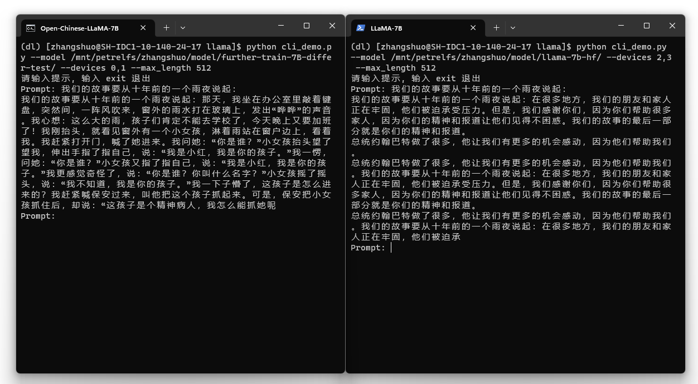
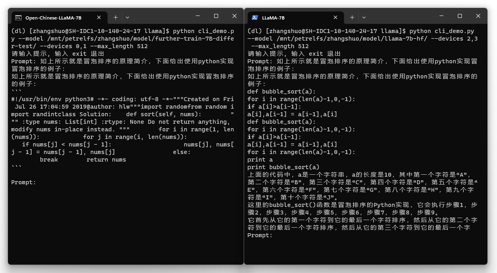
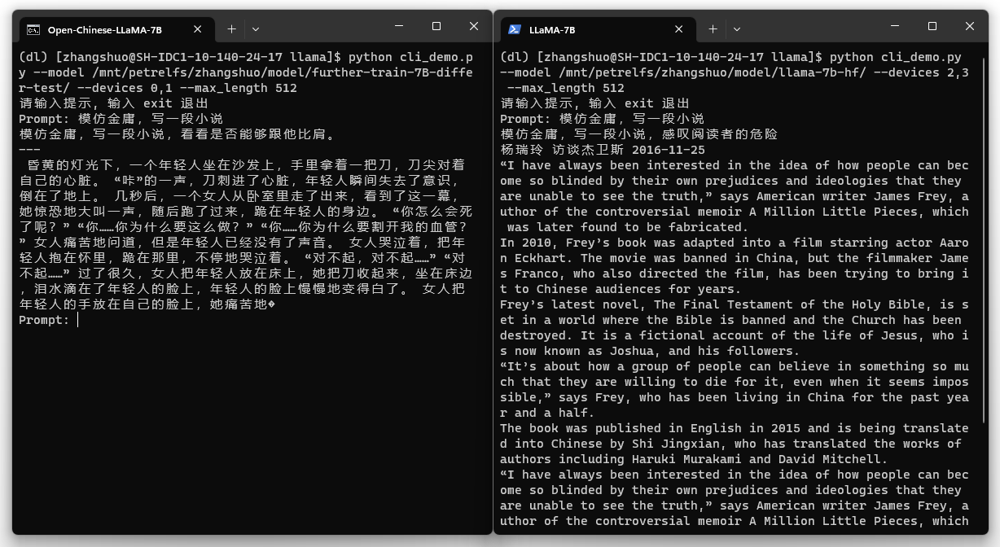

[**中文**](./README.md) | [**English**](./README_EN.md)

# Open-Chinese-LLaMA

[]()[]()[]()[]()

This project is a **Chinese large language model base** generated through **incremental pre-training on Chinese datasets** based on [LLaMA](https://github.com/facebookresearch/llama)-7B.

## Features

* This project provides a Chinese pre-trained model obtained through full-tuning, including Huggingface version weights.
* Compared to the original LLaMA, this model has significantly improved Chinese understanding and generation capabilities, achieving outstanding results in various downstream tasks. See [Evaluation](##Evaluation) for details.
* This project provides tools for converting Huggingface version weights and Meta version weights.
* Supports [🤗transformers](https://github.com/huggingface/transformers), and provides command-line tools for easy model testing.

## Contents
* [Model Download](##Model%20Download)
* [Local Demo](##Local%20Demo)
* [Evaluation](##Evaluation)
* [Model Format Conversion](##Model%20Format%20Conversion)

## Model Download

| Model Name                    | Weight Type | Download Link                                                     | SHA256                 |
| --------------------------- | -------- | ------------------------------------------------------------ | ---------------------- |
| Open-Chinese-LLaMA-7B-Patch | Patch    | [[🤗Huggingface]]() <br> [[Baidu Cloud]](https://pan.baidu.com/s/14E7iZKcH-5SHMDu97k70cg?pwd=gk34)<br>[[Google Driver]](https://drive.google.com/drive/folders/1THvuFzq_wojVfMLYV1qsSE_ddSjG0Ypv?usp=sharing) | [SHA256](./SHA256.txt) |

### Usage Notes

Meta officially released [LLaMA](https://github.com/facebookresearch/llama) does not open-source weights. To comply with relevant licenses, the model released this time is of the **patch** type, and must be used in conjunction with the official original weights.

We provide a script for installing the **patch**. After obtaining the official weights through regular channels, you can install the patch as follows:

```bash
python tools/patch_model.py --base_model <path_or_name_to_original_model>
                            --patch_model openlmlab/open-chinese-llama-7b-patch
                            --base_model_format <hf_or_raw>
```

Note: The installation method of this patch is inplace installation, that is, the installed patch is the complete Huggingface version of this model weight, and you can use transformers to load the model.

Note: This script depends on [OpenLMLab/collie](https://github.com/OpenLMLab/collie), please install this framework using the following command:

```bash
pip install git+https://github.com/OpenLMLab/collie.git
```

## Local Demo

For quick and easy model testing, we provide a command-line version of the demo. After successfully installing the patch according to [Usage Notes](###Usage%20Notes), you can use the script to start an interactive interface:

```bash
python cli_demo.py --model openlmlab/open-chinese-llama-7b-patch
                   --devices 0
                   --max_length 1024
                   --do_sample true
                   --top_k 40
                   --top_p 0.8
                   --temperature 0.7
                   --penalty 1.02
```

### Examples

Open-Chinese-LLaMA-7B on the left, original LLaMA on the right:

<div align=center></div>
<center style="font-size:14px;color:#C0C0C0;text-decoration:underline">text generation</center>
<br>
<div align=center></div>
<center style="font-size:14px;color:#C0C0C0;text-decoration:underline">code generation</center>
<br>
<div align=center></div>
<center style="font-size:14px;color:#C0C0C0;text-decoration:underline">instructions (Note: None have been Instruct-tuning)</center>
<br>

## Evaluation

Open-Chinese-LLaMA-7B performs far better than the original LLaMA on various tasks in Chinese and English datasets. The evaluation results of this model on some datasets are given below (the following indicators are Accuracy, the bigger the better):

| Dataset   | LLAMA 7B | Open-Chinese-LLaMA-7B |
| -------- | -------- | ----------- |
| OCNLI    | 31.5     | 45.5        | 
| CHID     | 25.87    | 71.47       | 
| TNEWS    | 8.70     | 26.78       | 
| CMRC     | 11.89    | 34.48       | 
| PIQA     | 79.8     | 77.31       |
| HumanEval | 10.5    | 14.63       |
| MBPP      | 17.7    | 17.2        |
| **Average**    | 26.57    | 41.05 |


Note: See [Benchmark.md](./benchmark/Benchmark.md) for full results

## Model Format Conversion

The model generated by `patch_model.py` in this project is **hf** format which can be loaded by [🤗transformers](https://github.com/huggingface/transformers). For convenience, we also provide a conversion tool between the official version model (raw) and hf:

```bash
python convert_model.py --model_path <path_or_name_to_your_hf_or_raw_model>
                        --source_format hf
                        --target_format raw
                        --target_path <path_you_want_to_save_the_converted_model>
                        --raw_parallel_degree 2
                        --raw_parallel_devices 0,1
```

Tip: When converting a model in raw format, you need to specify the tensor parallel size and corresponding device, and it can only be converted on a machine with a corresponding number of graphics cards.